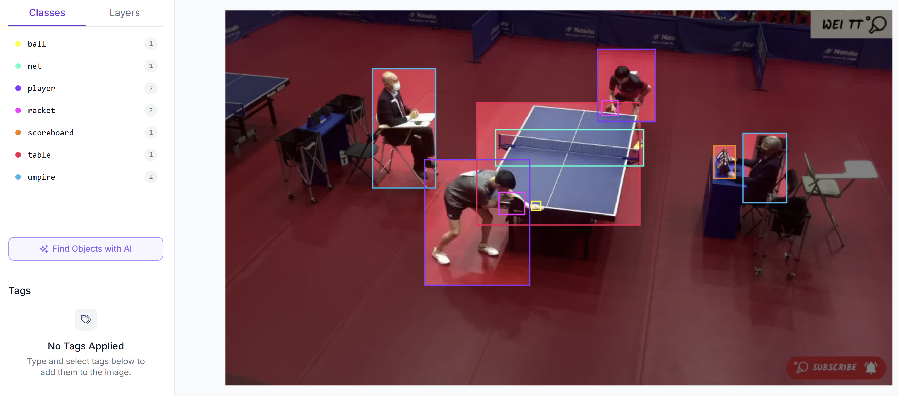
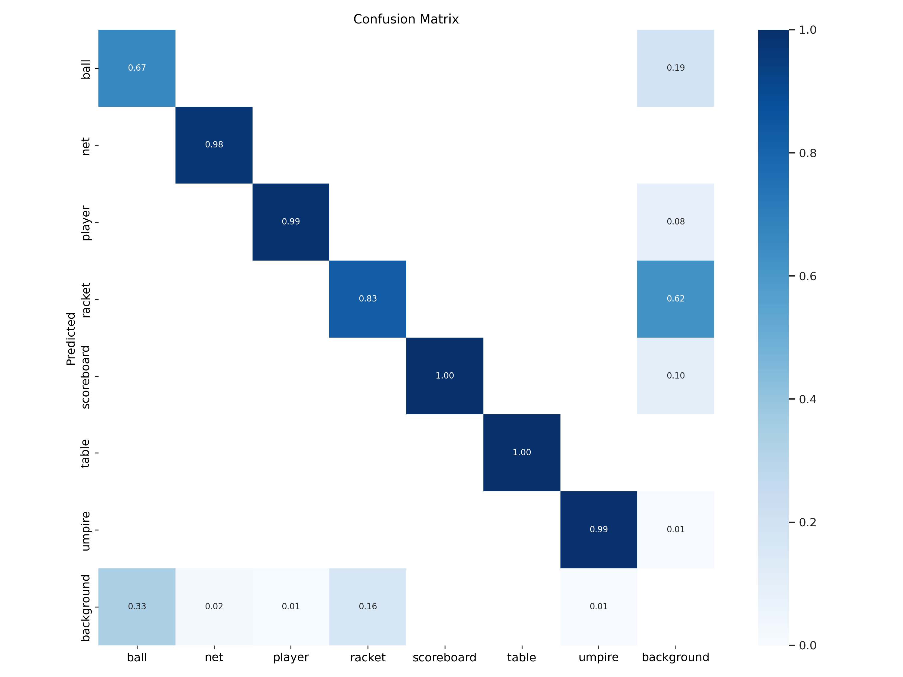
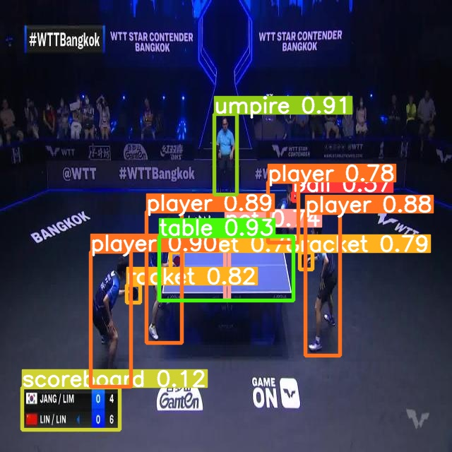

# YOLOv9 桌球場景物件偵測
### Table Tennis Scene Object Detection with YOLOv9


---

📄 [完整報告 PDF](docs/report.pdf)

## 專案簡介

本專案以 YOLOv9（gelan-c 架構）對桌球比賽場景進行多類別物件偵測。資料集來源為 Roboflow Universe，包含 7 個與桌球比賽相關之偵測類別，訓練資料共 3,108 張影像，驗證資料共 291 張影像。透過 25 個訓練週期，模型於驗證集達到整體 mAP50 **0.927**、mAP50-95 **0.702** 的水準，展現出在靜態大型物件（如球桌、球網）上具備優異的偵測能力，同時亦揭示出小型快速移動物件（乒乓球）所面臨之偵測挑戰。

---

## 偵測類別

本資料集共標註 7 個類別，各類別之標註樣本數如下表所示：

| 類別 | 英文標籤 | 資料集標註數 |
|------|----------|-------------|
| 球員 | player | 3,999 |
| 球拍 | racket | 3,299 |
| 裁判 | umpire | 1,926 |
| 計分板 | scoreboard | 1,573 |
| 球網 | net | 1,480 |
| 球桌 | table | 1,480 |
| 乒乓球 | ball | 1,364 |
| **合計** | **—** | **15,121** |



---

## 資料處理

### 前處理

- 影像統一縮放至 **640 × 640** 像素
- 標籤格式採用 YOLO 格式（class cx cy w h，各值正規化至 \[0, 1\]）
- 資料集依訓練／驗證集劃分，訓練集 **3,108** 張、驗證集 **291** 張

### 資料擴增

訓練過程採用以下資料擴增策略（依 `hyp.scratch-high.yaml` 設定）：

| 擴增方式 | 參數值 |
|----------|--------|
| HSV 色相偏移 | 0.015 |
| HSV 飽和度偏移 | 0.70 |
| HSV 明度偏移 | 0.40 |
| 隨機平移 | 0.10 |
| 隨機縮放 | 0.90 |
| 水平翻轉 | 0.50 |
| Mosaic 拼接 | 1.00 |
| Mixup | 0.15 |

---

## 模型訓練結果

### 整體指標

| 指標 | 數值 |
|------|------|
| mAP50 | **0.927** |
| mAP50-95 | **0.702** |
| Precision | 0.937 |
| Recall | 0.910 |

### 各類別表現

| 類別 | Precision | Recall | mAP50 | mAP50-95 |
|------|-----------|--------|-------|---------|
| ball | 0.823 | 0.623 | 0.687 | 0.239 |
| net | 1.000 | 0.968 | 0.995 | 0.812 |
| player | 0.974 | 0.986 | 0.988 | 0.750 |
| racket | 0.823 | 0.800 | 0.847 | 0.399 |
| scoreboard | 0.945 | 1.000 | 0.984 | 0.876 |
| table | 0.998 | 1.000 | 0.995 | 0.948 |
| umpire | 0.997 | 0.995 | 0.994 | 0.888 |

### 混淆矩陣



---

## 偵測效果展示



---

## 結果分析

### ball（乒乓球）偵測較差之原因

乒乓球（mAP50 = 0.687）為本次偵測任務中表現最弱之類別，主要原因如下：

1. **目標尺寸極小**：乒乓球直徑約 40 mm，在 640 × 640 像素影像中僅佔極少數像素，導致低解析度特徵圖難以有效擷取其特徵。
2. **高速運動模糊**：比賽中乒乓球移動速度可超過 100 km/h，相機快門時間若不足則產生運動模糊，使外觀特徵更加難以辨識。
3. **背景干擾**：乒乓球顏色（白或橙色）在複雜背景中可能與場景元素重疊，增加誤偵測風險。
4. **標註樣本相對稀少**：驗證集中 ball 僅有 265 個標註實例，為各類別中數量次低者，模型學習機會相對不足。

### racket（球拍）偵測效能分析

球拍（mAP50 = 0.847）表現次弱，可能原因包括：

1. **遮蔽問題**：球拍在擊球瞬間常與球員手部或球體重疊，造成部分遮蔽。
2. **外觀多樣性**：不同廠牌球拍在顏色、形狀及握柄設計上差異顯著，增加模型泛化之困難度。
3. **動態形變**：快速揮拍時，球拍在影像中呈現不同角度與姿態，邊界框標註難以精準涵蓋其完整形狀。

---

## 環境需求

| 套件 | 版本 |
|------|------|
| Python | 3.11.12 |
| PyTorch | 2.5.1+cu124 |
| torchvision | 0.20.1+cu124 |
| roboflow | 1.1.48 |
| CUDA | 12.4 |
| GPU（建議） | NVIDIA Tesla T4 或同等級以上 |

---

## 使用方式

### 1. 環境準備

建議於 Google Colab（含 GPU）或本地 CUDA 環境中執行。

```bash
git clone https://github.com/SkalskiP/yolov9.git
cd yolov9
pip install -r requirements.txt
pip install roboflow==1.1.48
pip3 install torch==2.5.1 --index-url https://download.pytorch.org/whl/cu124
pip3 install torchvision==0.20.1 --index-url https://download.pytorch.org/whl/cu124
```

### 2. 下載資料集

請先至 [Roboflow](https://app.roboflow.com/) 取得 API Key，並於 notebook 中填入：

```python
rf = roboflow.Roboflow(api_key="YOUR_API_KEY")
project = rf.workspace("your_workspace").project("your_project")
version = project.version(1)
dataset = version.download("yolov9")
```

### 3. 執行訓練

開啟 `train_yolov9_tableTennis.ipynb`，依序執行各 cell 即可完成資料下載、模型訓練、驗證與推論流程。

```bash
python train.py \
  --batch 16 --epochs 25 --img 640 --device 0 \
  --data tableTennis-1/data.yaml \
  --weights gelan-c.pt \
  --cfg models/detect/gelan-c.yaml \
  --hyp hyp.scratch-high.yaml
```
